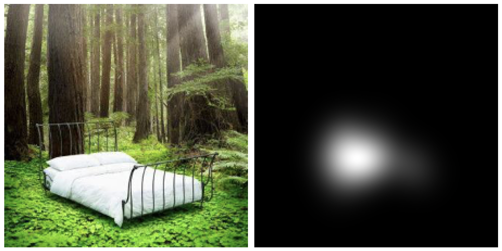

# [64-438/CV2] Eye Fixation Prediction





## Data
The provided ZIP files must be extracted into the directory `data/` in the project root. The `data/` directory is expected to have the following structure:

```
data/
├── center_bias_density.npy
├── fixations/
│   ├── test
│   ├── validation
│   └── train
├── images/
│   ├── test
│   ├── validation
│   └── train
├── test_images.txt
├── train_fixations.txt
├── train_images.txt
├── train_small_images.txt
├── val_fixations.txt
└── val_images.txt
```

## Model
The model is based on the U-Net architecture [[Ronneberger et al., 2015]](https://arxiv.org/abs/1505.04597). It uses a ResNeXt-50 [[Xie et al., 2016]](https://arxiv.org/abs/1611.05431v2) backbone pre-trained on [ImageNet](https://www.image-net.org) and a decoder with transposed convolutions for upsampling.